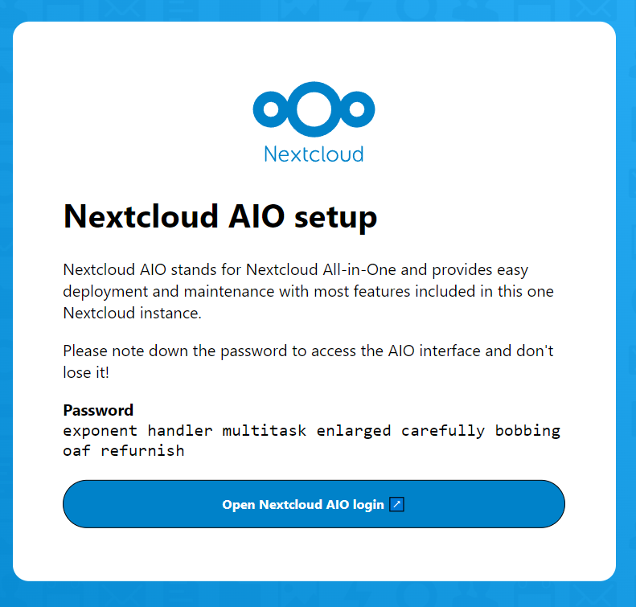
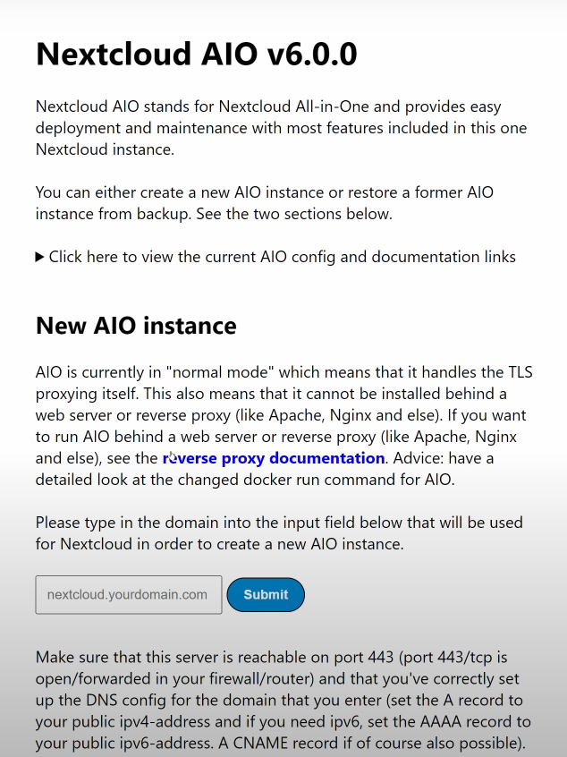
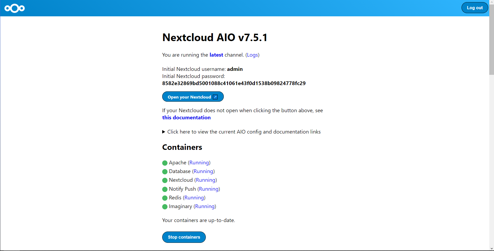
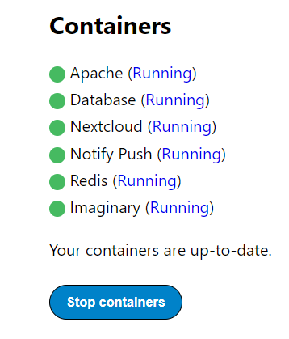
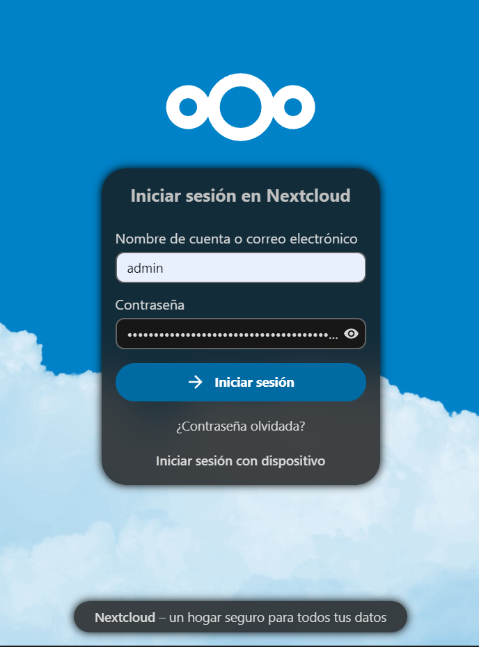
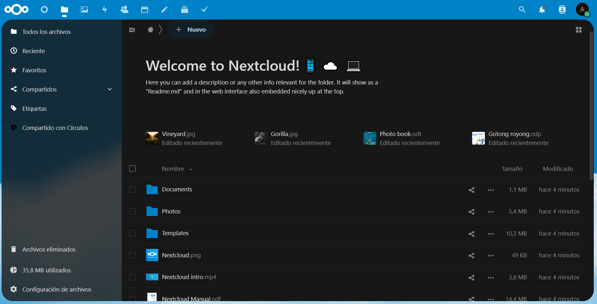

# Instalación y configuración de NextCloud.

- En este repositorio hablaremos sobre como instalar y configurar la herramienta Nextcloud.

## Creación del script.

Para esta herramienta tendremos que ejecutar una serie de comandos para su funcionamiento, por lo tanto, podemos hacer un script para hacerlo de manera automática en el caso de que queramos realizar la instalación en otra máquina.

- El primer comando que utilizaremos seran los siguientes: 
    ``` 
    #Lo utilizamos para hacer un update de los archivos de la máquina.
    
    set -x
    apt update -y 

    #Lo utilizamos para "upgradear" los archivos que anteriormente hemos actualizado.

    apt upgrade -y
    ```
- Como siguiente paso tendremos que instalar *_docker_*, para su instalación haremos uso del siguiente bloque de comandos, podemos ejecutarlos en un script individual o de manera conjunta para un script completo.

- El bloque de comandos seria el siguiente:

    ``` 
    #Instalamos docker en nuestra máquina, los podemos ejecutar todos de manera conjunta.
    
    apt install apt-transport-https ca-certificates curl software-properties-common -y
    curl -fsSL https://download.docker.com/linux/ubuntu/gpg | sudo apt-key add -
    add-apt-repository "deb [arch=amd64] https://download.docker.com/linux/ubuntu focal stable" -y

    #Instalamos el docker haciendo uso de apt.

    apt install docker-ce -y    

    ```

## Instalación del docker de NextCloud.

Si la configuración anterior ha sido instala de manera correcta, podemos proceder a la instalación del docker de *_NextCloud_*

- El comando para su instalación es el siguiente: 

```
#Iniciamos el contenedor para NextCloud

docker run --init --sig-proxy=false --name nextcloud-aio-mastercontainer --restart always --publish 8080:8080 --publish 8443:8443 --volume nextcloud_aio_mastercontainer:/mnt/docker-aio-config --volume /var/run/docker.sock:/var/run/docker.sock:ro nextcloud/all-in-one:latest

```

# Inicio de sesión una vez realizada la instalación.

1. Paso: Accedemos a un navegador y utilizamos la siguiente estructura para la *_URL_* : `https:\\[ip_servidor]:8080`. Cabe recalcar que si no añades el *_https_* , no funcionará.

2. La siguiente pantalla que nos saldrá una vez hayamos accedido será la siguiente: 

    

- En esta pantalla lo que tenemos que hacer es pulsar el recuadro de color azúl.

3. Despues de realizar el paso anterior, nos saldrá para poner la contraseña. Tendremos que poner la URL que hemos creado. 

    


4. Te pedirá un login y le pones la contraseña que hemos copiado del punto anterior. Te saldrá el nombre del admin y su correspondiente password. Junto una serie de contenedores que se iniciaran al cabo de unos minutos.

    

- En esta pestaña tardará un poco en arrancar todos los contenedores, pero una vez esten todos funcionales debería de salir de la siguiente manera:

    

5. El siguiente paso como podemos observar en el paso anterior, podremos acceder al login. 
Donde tendremos que poner el usuario y la contraseña que hemos visto anteriormente.

    

6. Por último paso ya podremos acceder a la pantalla principal y empezar con la configuración que veamos necesaria. 

    


### ANEXO

- Esta máquina la hemos creado y configurado a través de un laboratorio de aws.
 Cabe recalcar que para el punto 3 de la documentación anterior hemos utilizado la siguiente página:
     [Enlace a la página web](https://www.noip.com/es-MX/remote-access?gclid=Cj0KCQjwtJKqBhCaARIsAN_yS_mVSE9umWnOHjny6GRypr70bFObu7nVoZq2qCQ6HYpekSnvP-ZoUGQaApweEALw_wcB&utm_campaign=free-dynamic-dns&utm_medium=cpc&utm_source=google) que sirve para generar un dominio a través de una ip durante "X".

- También puedes seguir el siguiente video, donde la parte mas importante en referencia a Nextcloud es a partir del minuto "41:38"

    [Enlace al video de Youtube](https://www.youtube.com/watch?v=xBIowQ0WaR8)